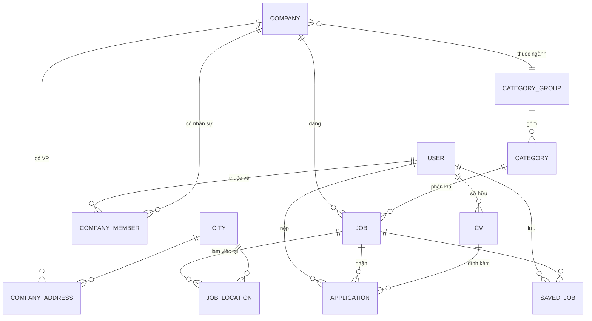

# DESIGN — Clone TopCV (f8-prj)

> Trạng thái: **ĐÃ CHỐT — sẵn sàng code** (cập nhật 12/08/2026, sau khi xác nhận 7 câu hỏi mở).
> Nguồn: `React - Trang tính1.csv` (yêu cầu) + `data.json` (mẫu dữ liệu API).

---

## 1. Phạm vi đã chốt

| Hạng mục | Quyết định |
|---|---|
| Kiểu dự án | Fullstack, FE và BE tách riêng (2 folder trong 1 monorepo) |
| Frontend | Vite + React 19 + TypeScript + TailwindCSS |
| Backend | FastAPI (Python 3.12) + PostgreSQL 16 |
| Nộp CV | **Chỉ upload file PDF** + cover letter |
| CV builder online | **BỎ HẲN** — không thiết kế, không code |
| Ngôn ngữ UI | Chỉ tiếng Việt (không i18n) |
| Tra cứu MST | **Tích hợp thật VietQR API** (xem 5.8) |
| Tỉnh/thành | Seed **đủ 34 đơn vị** sau sáp nhập 01/07/2025 (xem Phụ lục A) |
| Gửi email | **KHÔNG** — mọi thông báo hiển thị trong app |
| Duyệt tin tuyển dụng | **KHÔNG cần admin duyệt.** Công ty đã `APPROVED` → đăng tin là `PUBLISHED` ngay |
| Lưu file CV | **AWS S3** (presigned URL), không lưu disk |
| Môi trường dev | **Docker Compose cả 3**: `frontend` + `backend` + `postgres` |

### 1.1. Map yêu cầu → phase

| # | Yêu cầu trong CSV | Đối tượng | Phase |
|---|---|---|---|
| 1 | Login / logout | Nhà tuyển dụng (NTD) + Ứng viên (UV) | P1 |
| 2 | Tạo tin tuyển dụng (có format text) | NTD | P3 |
| 3 | Danh sách jobs | UV — **không cần login** | P4 |
| 4 | Chi tiết 1 job | UV — không cần login; apply thì mới bắt login | P4, P5 |
| 5 | Tạo CV online | — | ❌ Bỏ |
| 6 | Danh sách công ty + duyệt hồ sơ đăng ký | Admin | P2, P6 |

---

## 2. Actor & phân quyền

4 vai trò, lưu ở `users.role`:

| Role | Là ai | Vào được gì |
|---|---|---|
| `GUEST` | Khách chưa login | Xem list job, chi tiết job, list công ty, trang công ty |
| `CANDIDATE` | Ứng viên | Guest + quản lý CV, apply job, xem job đã ứng tuyển / đã lưu |
| `EMPLOYER` | Nhà tuyển dụng | Quản lý hồ sơ công ty của mình, CRUD tin tuyển dụng, xem & đổi trạng thái ứng viên ứng tuyển vào tin của mình |
| `ADMIN` | Admin TopCV | Duyệt/từ chối công ty, duyệt/gỡ tin tuyển dụng, quản lý user |

### 2.1. Ma trận quyền (rút gọn)

| Hành động | GUEST | CANDIDATE | EMPLOYER | ADMIN |
|---|:--:|:--:|:--:|:--:|
| `GET /jobs`, `GET /jobs/{slug}` | ✅ | ✅ | ✅ | ✅ |
| `GET /companies`, `GET /companies/{slug}` | ✅ | ✅ | ✅ | ✅ |
| `POST /applications` (apply) | ❌ 401 | ✅ | ❌ 403 | ❌ 403 |
| `POST/PATCH/DELETE /jobs` | ❌ | ❌ | ✅ (chỉ job của công ty mình) | ✅ |
| `GET /jobs/{id}/applications` | ❌ | ❌ | ✅ (chỉ job của mình) | ✅ |
| `PATCH /admin/companies/{id}/status` | ❌ | ❌ | ❌ | ✅ |
| `PATCH /admin/jobs/{id}/takedown` (gỡ tin vi phạm) | ❌ | ❌ | ❌ | ✅ |

> **Nguyên tắc:** phân quyền enforce ở **backend** (FastAPI dependency `require_role(...)` + kiểm tra ownership trong service). Frontend ẩn/hiện menu chỉ là UX, **không phải bảo mật**.

---

## 3. Kiến trúc tổng thể

```
┌──────────────────────────┐        ┌────────────────────────────┐
│  Browser                 │        │  FastAPI (uvicorn)         │
│  ┌────────────────────┐  │        │  ┌──────────────────────┐  │
│  │ React SPA (Vite)   │──┼─HTTPS─▶│  │ api/v1 routers       │  │
│  │ - React Router     │  │  JSON  │  │ deps: auth, role     │  │
│  │ - TanStack Query   │  │        │  └──────────┬───────────┘  │
│  │ - Zustand (auth)   │  │        │  ┌──────────▼───────────┐  │
│  │ - RHF + Zod        │  │        │  │ services (nghiệp vụ) │  │
│  └────────────────────┘  │        │  └──────────┬───────────┘  │
└──────────────────────────┘        │  ┌──────────▼───────────┐  │
                                    │  │ SQLAlchemy 2.0 models│  │
                                    │  └──────────┬───────────┘  │
                                    └─────────────┼──────────────┘
                                                  ▼
                                    ┌────────────────────────────┐
                                    │ PostgreSQL 16              │
                                    └────────────────────────────┘

Dịch vụ ngoài:
  ┌──────────────────────────┐   ┌───────────────────────────────────────┐
  │ AWS S3 — file CV (PDF)   │   │ VietQR API — tra cứu MST              │
  │ upload/download qua      │   │ GET api.vietqr.io/v2/business/{mst}   │
  │ presigned URL, bucket    │   │ gọi từ BACKEND (không gọi từ browser) │
  │ private hoàn toàn        │   └───────────────────────────────────────┘
  └──────────────────────────┘
```

**Docker Compose (dev):** 3 service — `postgres` (volume giữ data), `backend` (uvicorn `--reload`, mount code), `frontend` (vite dev server, mount code + HMR). S3 và VietQR gọi ra ngoài thật.

### 3.1. Cấu trúc thư mục

```
f8-prj/
├── docker-compose.yml               # postgres + backend + frontend
├── .gitignore                       # .env, storage/, node_modules/, __pycache__/
├── docs/
│   ├── DESIGN.md                    ← file này
│   └── mockups/index.html           ← mockup UI
├── backend/
│   ├── Dockerfile
│   ├── app/
│   │   ├── main.py                  # khởi tạo FastAPI, CORS, exception handlers
│   │   ├── core/
│   │   │   ├── config.py            # Pydantic Settings, đọc từ .env
│   │   │   ├── security.py          # hash password, tạo/verify JWT
│   │   │   └── deps.py              # get_db, get_current_user, require_role
│   │   ├── db/
│   │   │   ├── session.py
│   │   │   └── models/              # user.py, company.py, job.py, application.py...
│   │   ├── schemas/                 # Pydantic v2: request/response DTO
│   │   ├── api/v1/
│   │   │   ├── auth.py  companies.py  jobs.py  applications.py
│   │   │   ├── cvs.py   categories.py  admin.py
│   │   │   └── router.py            # gom tất cả router
│   │   ├── services/                # logic nghiệp vụ, tách khỏi router
│   │   ├── integrations/
│   │   │   ├── s3.py                # upload/presign/delete — che boto3 sau interface
│   │   │   └── vietqr.py            # client tra cứu MST + xử lý lỗi/timeout
│   │   └── utils/
│   │       ├── slug.py              # sinh slug tiếng Việt không dấu
│   │       └── sanitize.py          # bleach — làm sạch HTML từ editor
│   ├── alembic/                     # migration
│   ├── seeds/                       # cities.py (34 tỉnh/thành), categories.py
│   ├── tests/
│   ├── .env.example                 # KEY RỖNG — không bao giờ commit .env thật
│   └── pyproject.toml
└── frontend/
    ├── Dockerfile
    ├── src/
    │   ├── main.tsx  App.tsx  routes.tsx
    │   ├── lib/
    │   │   ├── apiClient.ts         # axios instance + interceptor refresh token
    │   │   └── queryClient.ts
    │   ├── types/                   # types sinh theo data.json (mục 4)
    │   ├── components/ui/           # Button, Input, Select, Modal, Pagination, Badge...
    │   ├── components/layout/       # PublicHeader, EmployerSidebar, AdminSidebar
    │   ├── features/
    │   │   ├── auth/                # api.ts, hooks.ts, LoginPage, RegisterPage...
    │   │   ├── jobs/                # JobCard, JobFilterBar, JobListPage, JobDetailPage
    │   │   ├── companies/
    │   │   ├── applications/
    │   │   ├── cvs/
    │   │   └── admin/
    │   ├── stores/authStore.ts      # Zustand: user + accessToken (memory)
    │   └── hooks/
    ├── .env.example
    └── vite.config.ts
```

**Lý do tách `services/` khỏi `api/`:** router chỉ lo HTTP (parse input, trả status code), service lo nghiệp vụ. Nhờ vậy test nghiệp vụ không cần dựng HTTP client, và logic dùng lại được giữa các endpoint.

---

## 4. Data model

### 4.1. ERD



### 4.2. Bảng chi tiết

Quy ước chung: `id UUID PK`, `created_at`/`updated_at TIMESTAMPTZ NOT NULL DEFAULT now()`. Xoá dùng **soft delete** (`deleted_at`) cho `job` và `company` để không mất lịch sử ứng tuyển.

#### `users`
| Cột | Kiểu | Ghi chú |
|---|---|---|
| `email` | citext UNIQUE NOT NULL | dùng `citext` để email không phân biệt hoa/thường |
| `password_hash` | text NOT NULL | bcrypt (passlib), **không bao giờ trả ra API** |
| `role` | enum(`CANDIDATE`,`EMPLOYER`,`ADMIN`) NOT NULL | `GUEST` không có bản ghi |
| `full_name` | text NOT NULL | |
| `phone_number` | varchar(20) | |
| `avatar_url` | text | |
| `is_active` | bool DEFAULT true | admin khoá tài khoản |

> Không có cột `email_verified_at` — đã chốt **không gửi email**, nên không có luồng xác thực email.

#### `refresh_tokens`
| Cột | Kiểu | Ghi chú |
|---|---|---|
| `user_id` | FK → users, ON DELETE CASCADE | |
| `jti` | varchar(36) UNIQUE NOT NULL | id của refresh token. **Chỉ lưu jti, không lưu chuỗi token** — rò rỉ bảng này cũng không đăng nhập thay người dùng được |
| `expires_at` | timestamptz NOT NULL | |
| `revoked_at` | timestamptz NULL | đặt khi logout hoặc khi token được luân chuyển |

> Bảng này **không có trong bản thiết kế đầu**, thêm ở P1 để thực hiện được yêu cầu
> "logout thu hồi refresh token". Nếu chỉ xoá cookie thì token bị đánh cắp vẫn dùng
> được tới khi hết hạn.

#### `cities`
| Cột | Kiểu | Ghi chú |
|---|---|---|
| `id` | int PK | giữ nguyên quy ước `data.json`: 1 = Hà Nội, 2 = TP.HCM |
| `name` | text NOT NULL | |
| `slug` | text UNIQUE NOT NULL | |
| `is_municipality` | bool | true với 6 TP trực thuộc TW — để ưu tiên hiển thị lên đầu dropdown |

Seed **đủ 34 đơn vị hành chính** sau sáp nhập 01/07/2025 — danh sách đầy đủ ở **Phụ lục A**.

#### `category_groups` / `categories`
Đúng theo `data.json`: `category_groups(id, group_name, group_slug)`, `categories(id, group_id FK, name, slug)`.
Lưu ý `group-6 "Lao động phổ thông"` trong data mẫu **không có** mảng `categories` → seed thêm 1 category mặc định trùng tên group, để job luôn gắn được `category_id NOT NULL`.

#### `companies`
| Cột | Kiểu | Ghi chú |
|---|---|---|
| `tax_code` | varchar(14) UNIQUE NOT NULL | MST — khoá nghiệp vụ, 10 hoặc 13 số |
| `company_name` | text NOT NULL | |
| `international_name` | text | |
| `short_name` | text | |
| `director` | text NOT NULL | |
| `headquarters_address` | text NOT NULL | |
| `issued_date` | date | ngày cấp GPKD |
| `email` | citext NOT NULL | |
| `phone_number` | varchar(20) NOT NULL | |
| `website` | text | |
| `logo_url` | text | |
| `company_size` | enum | `1-9`, `10-24`, `25-99`, `100-499`, `500-1000`, `1000+` — chuẩn hoá thay vì free text như data mẫu |
| `category_group_id` | FK → `category_groups` | Công ty gắn ở mức **nhóm ngành** (đã xác nhận) |
| `description_html` | text | HTML đã sanitize |
| `status` | enum(`PENDING`,`APPROVED`,`REJECTED`) DEFAULT `PENDING` | admin duyệt |
| `rejected_reason` | text | bắt buộc khi `REJECTED` |
| `verification_tier` | enum(`UNVERIFIED`,`VERIFIED`) DEFAULT `UNVERIFIED` | badge "Đã xác thực", chỉ admin gắn được và chỉ cho công ty đã `APPROVED` |
| `tax_code_verified_at` | timestamptz NULL | thời điểm tên công ty được đối chiếu khớp với VietQR. NULL = chưa đối chiếu được (VietQR không phản hồi lúc đăng ký) → admin cần soi kỹ hơn |
| `slug` | text UNIQUE NOT NULL | sinh từ `short_name`/`company_name` |

#### `company_members`
`(user_id FK, company_id FK, member_role enum(OWNER, RECRUITER))`, UNIQUE `(user_id)`.
→ 1 user EMPLOYER thuộc đúng 1 công ty. Người đăng ký công ty là `OWNER`.

#### `company_addresses`
`(id, company_id FK, city_id FK, address_detail text)` — map thẳng `address_list` trong `data.json`.

#### `jobs`
| Cột | Kiểu | Ghi chú |
|---|---|---|
| `company_id` | FK NOT NULL | |
| `title` | text NOT NULL | |
| `slug` | text UNIQUE NOT NULL | `slugify(title) + "-" + short_id` |
| `category_id` | FK → `categories` NOT NULL | |
| `specialty` | text | vd "Frontend Developer" |
| `job_type` | enum | `FULL_TIME`,`PART_TIME`,`CONTRACT`,`INTERNSHIP`,`FREELANCE` |
| `experience_level` | enum | `NO_EXP`,`UNDER_1`,`1_2`,`2_3`,`3_5`,`OVER_5` — chuẩn hoá để filter được (data mẫu đang là text tự do `"3-5 năm"`) |
| `gender` | enum(`NOT_REQUIRED`,`MALE`,`FEMALE`) DEFAULT `NOT_REQUIRED` | |
| `quantity` | int NOT NULL CHECK > 0 | |
| `salary_type` | enum(`RANGE`,`FROM`,`UP_TO`,`AGREEMENT`) | |
| `salary_min` / `salary_max` | bigint NULL | NULL khi `AGREEMENT` (data mẫu dùng `0` — dùng NULL sạch hơn, tránh nhầm "lương 0đ") |
| `currency` | varchar(3) DEFAULT `VND` | |
| `deadline` | timestamptz NOT NULL | CHECK `deadline > created_at` |
| `status` | enum(`DRAFT`,`PUBLISHED`,`CLOSED`,`EXPIRED`,`TAKEN_DOWN`) | xem 4.3 — **không có `PENDING`** vì tin không cần duyệt |
| `takedown_reason` | text | bắt buộc khi admin gỡ tin |
| `is_hot` | bool DEFAULT false | chỉ ADMIN set được |
| `view_count` | int DEFAULT 0 | |
| `description_html`, `requirements_html`, `benefits_html` | text NOT NULL | HTML đã sanitize |
| `created_by` | FK → users | |

Index: `(status, deadline)`, `(category_id)`, `(company_id)`, GIN full-text trên `title`.

#### `job_locations`
`(id, job_id FK, city_id FK, address_detail text)`.

#### `cvs`
`(id, candidate_id FK, s3_key text, original_name text, file_size int, is_primary bool)`.
`s3_key` dạng `cvs/{candidate_id}/{uuid}.pdf` trong bucket **private**. Không lưu URL public.
Tải về: `GET /cvs/{id}/download` → backend kiểm tra quyền → trả **presigned URL hạn 5 phút** (302 redirect).

#### `applications`
| Cột | Ghi chú |
|---|---|
| `job_id`, `candidate_id`, `cv_id` | FK NOT NULL |
| `cover_letter` | text, max 2000 ký tự |
| `status` | enum(`PENDING`,`VIEWED`,`SHORTLISTED`,`REJECTED`,`HIRED`) DEFAULT `PENDING` |
| UNIQUE `(job_id, candidate_id)` | chặn apply trùng ở tầng DB, không chỉ tầng app |

#### `saved_jobs`
`(user_id, job_id)` — PK kép. Tính năng phụ, phase cuối.

### 4.3. Vòng đời tin tuyển dụng

Đã chốt: **tin KHÔNG cần admin duyệt.** Công ty đã `APPROVED` thì bấm đăng là lên ngay.

```
NTD soạn tin ──▶ DRAFT ──(bấm "Đăng tin")──▶ PUBLISHED ◀──(NTD mở lại, còn hạn)──┐
                                                │                                │
                    ┌───────────────┬───────────┴──────────┐                     │
              (NTD đóng tin)  (quá deadline,        (admin gỡ vì vi phạm)         │
                    │          cron chạy hằng ngày)        │                      │
                    ▼               ▼                      ▼                      │
                 CLOSED          EXPIRED               TAKEN_DOWN                  │
                    └───────────────┴──────────────────────────────────────────────┘
                                    (NTD sửa nội dung + gia hạn deadline → PUBLISHED lại)
```

**Bất biến (invariant) phải enforce ở backend:**
- Chỉ job `PUBLISHED` **và** `deadline > now()` mới xuất hiện ở API công khai và mới nhận `application`.
- Công ty `status != APPROVED` → **không** tạo được job ở trạng thái `PUBLISHED` (chỉ lưu `DRAFT`). Lỗi `COMPANY_NOT_APPROVED`.
- Khi admin đổi công ty từ `APPROVED` → `REJECTED`: toàn bộ job `PUBLISHED` của công ty đó tự chuyển `TAKEN_DOWN` (chạy trong cùng transaction).
- `TAKEN_DOWN` chỉ admin đặt được; NTD không tự gỡ trạng thái này, phải sửa tin rồi đăng lại.

> **Chốt khi triển khai P3 — "sửa tin rồi đăng lại" nghĩa là gì.** Endpoint đổi
> trạng thái **không** nhận `TAKEN_DOWN → PUBLISHED`. Đường duy nhất: NTD `PATCH`
> nội dung tin, lúc đó tin tự về `DRAFT` và xoá `takedown_reason`, rồi mới đăng
> lại được. Nếu cho bấm đăng lại ngay mà không sửa gì thì quyết định gỡ tin của
> admin vô nghĩa — NTD bấm một cái là tin lên lại. Cách này dùng đúng cơ chế đã
> có (giống hồ sơ công ty `REJECTED` → `PENDING` khi sửa), không cần thêm cột
> `taken_down_at` để so mốc thời gian.
>
> **Gửi `status=PUBLISHED` khi công ty chưa duyệt thì báo lỗi 403, không âm thầm
> hạ xuống `DRAFT`.** Lưu lặng lẽ thành nháp là NTD tưởng tin đã lên, tới lúc
> không có ứng viên nào mới phát hiện.

---

## 5. API contract

Base: `/api/v1`. Auth: header `Authorization: Bearer <access_token>`.

### 5.1. Auth
| Method | Path | Quyền | Mô tả |
|---|---|---|---|
| POST | `/auth/register/candidate` | public | email, password, full_name, phone |
| POST | `/auth/register/employer` | public | thông tin user + **toàn bộ thông tin công ty** (tạo `company` ở `PENDING`) |
| POST | `/auth/login` | public | trả `access_token` (15 phút) trong body + `refresh_token` (7 ngày) trong **httpOnly cookie** |
| POST | `/auth/refresh` | cookie | cấp access token mới **và luân chuyển refresh token** — token cũ bị thu hồi ngay, nên bản sao bị đánh cắp chỉ dùng được một lần |
| POST | `/auth/logout` | auth | thu hồi refresh token |
| GET | `/auth/me` | auth | user hiện tại + company kèm theo nếu là EMPLOYER |

### 5.2. Public
| Method | Path | Mô tả |
|---|---|---|
| GET | `/categories` | cây `category_groups` → `categories` (cache 1h) |
| GET | `/cities` | danh sách tỉnh/thành |
| GET | `/jobs` | list + filter, xem 5.3 |
| GET | `/jobs/{slug}` | chi tiết job, **kèm object `company` lồng vào** đúng như `data.json` |
| GET | `/companies` | list công ty `APPROVED` |
| GET | `/companies/{slug}` | chi tiết + danh sách job đang tuyển |

### 5.3. `GET /jobs` — query params
`q` (từ khoá), `category_id`, `group_id`, `city_id`, `job_type`, `experience_level`, `salary_min`, `salary_max`, `is_hot`, `sort` (`newest` | `salary_desc` | `deadline`), `page` (default 1), `page_size` (default 20, max 50).

Response chuẩn cho mọi endpoint list:
```json
{
  "items": [ /* ... */ ],
  "meta": { "page": 1, "page_size": 20, "total": 137, "total_pages": 7 }
}
```

> **Ghi chú quan trọng về shape:** `data.json` nhúng **full object company** vào trong mỗi job. DB thì chuẩn hoá (job chỉ giữ `company_id`). API sẽ trả về đúng dạng lồng nhau như `data.json` để FE dùng thẳng — nhưng ở endpoint **list** chỉ trả `company` rút gọn (`id, company_name, short_name, logo_url, slug, verification_tier`) để giảm payload. Endpoint **detail** mới trả full.

> **Chốt khi triển khai P4 — "full company" ở API công khai KHÔNG có thông tin liên hệ.**
> `PublicCompanyOut` cố ý bỏ `email`, `phone_number`, `director`, `tax_code`,
> `rejected_reason`, `status`. Phơi email và số điện thoại nhà tuyển dụng ra
> internet là mời bot thu thập để gửi rác — ứng viên liên hệ qua chức năng ứng
> tuyển chứ không cần địa chỉ liên hệ trực tiếp. `rejected_reason` là ghi chú nội
> bộ giữa quản trị viên và nhà tuyển dụng. Đây là điểm khác `data.json` mẫu, có
> test khẳng định các trường này không xuất hiện.
>
> **Ba chi tiết truy vấn đáng nhớ:**
> - Điều kiện hiển thị công khai gom vào một chỗ (`_visible_to_public`): `PUBLISHED`
>   **và** `deadline > now()` **và** công ty `APPROVED`. Lọc theo hạn ngay trong
>   truy vấn chứ không chờ cron `EXPIRED` của P7 — cron chạy hằng ngày, không lọc
>   thì tin quá hạn vẫn hiện tới lần chạy kế tiếp và ứng viên nộp vào chỗ đã đóng.
> - Lọc theo `city_id` dùng `EXISTS` chứ không `JOIN`: một tin có nhiều địa điểm,
>   join sẽ nhân bản dòng làm sai cả `total` lẫn phân trang.
> - `sort=salary_desc` đẩy tin "thoả thuận" (cả hai cột lương NULL) xuống cuối
>   bằng `NULLS LAST`; mặc định của Postgres khi sắp giảm dần là đưa NULL lên đầu.
> - Lọc theo `salary_min`/`salary_max` loại tin "thoả thuận" ra khỏi kết quả —
>   không có cách nào biết nó đạt mức người dùng nhập hay không. UI ghi rõ điều này.

### 5.4. Employer (`role=EMPLOYER`)
| Method | Path | Mô tả |
|---|---|---|
| GET/PATCH | `/employer/company` | xem/sửa hồ sơ công ty mình |
| POST | `/employer/company/addresses` | thêm địa chỉ VP |
| GET | `/employer/jobs` | list job của công ty mình (mọi status) |
| POST | `/employer/jobs` | tạo tin (`DRAFT` hoặc `PUBLISHED` luôn) |
| PATCH | `/employer/jobs/{id}` | sửa tin |
| DELETE | `/employer/jobs/{id}` | soft delete |
| PATCH | `/employer/jobs/{id}/status` | `DRAFT→PUBLISHED`, `PUBLISHED→CLOSED`, `CLOSED→PUBLISHED` |
| GET | `/employer/jobs/{id}/applications` | ds ứng viên đã apply |
| PATCH | `/employer/applications/{id}/status` | đổi `PENDING→VIEWED→SHORTLISTED/REJECTED/HIRED` |
| GET | `/employer/applications/{id}/cv` | tải CV của ứng viên đó |

### 5.5. Candidate (`role=CANDIDATE`)
| Method | Path | Mô tả |
|---|---|---|
| GET/POST/DELETE | `/me/cvs` | quản lý CV PDF |
| PATCH | `/me/cvs/{id}/primary` | đặt CV mặc định |
| POST | `/applications` | apply: `{ job_id, cv_id, cover_letter }` |
| GET | `/me/applications` | job đã ứng tuyển + trạng thái |
| GET/POST/DELETE | `/me/saved-jobs` | job đã lưu |

### 5.6. Admin (`role=ADMIN`)
| Method | Path | Mô tả |
|---|---|---|
| GET | `/admin/companies?status=PENDING` | hàng đợi duyệt công ty |
| PATCH | `/admin/companies/{id}/status` | `{ status, rejected_reason? }` |
| PATCH | `/admin/companies/{id}/verification` | gắn/gỡ badge VERIFIED |
| GET | `/admin/jobs` | ds toàn bộ tin (mọi trạng thái, mọi công ty) để giám sát |
| PATCH | `/admin/jobs/{id}/takedown` | `{ takedown_reason }` — gỡ tin vi phạm |
| PATCH | `/admin/jobs/{id}/hot` | bật/tắt `is_hot` |
| GET | `/admin/users` | ds user, khoá/mở tài khoản |

### 5.7. Tích hợp VietQR — tra cứu mã số thuế

**Endpoint của mình:** `GET /api/v1/companies/lookup-tax-code/{tax_code}` (public, có rate limit).

Backend gọi tiếp `GET https://api.vietqr.io/v2/business/{taxCode}`.

> **Gọi từ backend, KHÔNG gọi thẳng từ browser** — để kiểm soát rate limit, cache lại, và không lộ chi tiết tích hợp ra client.

**⚠️ VietQR chỉ trả về 5 trường** (đã kiểm chứng từ tài liệu chính thức):

```json
{ "code": "00", "desc": "Success - Thành công",
  "data": { "id": "0316794479", "name": "CÔNG TY TNHH CASSO",
            "internationalName": "CASSO COMPANY LIMITED",
            "shortName": "CASSO", "address": "..." } }
```

| Trường trong form đăng ký | Nguồn |
|---|---|
| `company_name`, `international_name`, `short_name`, `headquarters_address` | ✅ VietQR tự điền |
| `director`, `phone_number`, `email`, `issued_date`, `website`, `company_size`, `category_group_id`, `logo` | ❌ **VietQR không có** → NTD nhập tay |

→ File yêu cầu ghi `mst -> name, international_name, director, phone…`, nhưng thực tế API **không trả `director` và `phone`**. UI sẽ ghi rõ: ô nào tự điền (nền xám, vẫn sửa được), ô nào bắt buộc nhập tay.

**Xử lý lỗi & phòng thủ:**

| Tình huống | Xử lý |
|---|---|
| Timeout (**10s**, xem ghi chú dưới) hoặc VietQR chết | Trả `503 TAX_LOOKUP_UNAVAILABLE` → UI hiện "Không tra cứu được, vui lòng nhập tay". **Không chặn đăng ký.** |
| `code != "00"` (không tìm thấy MST) | Trả `404 TAX_CODE_NOT_FOUND`, cache 30 phút |
| Bị 429 hoặc 5xx từ VietQR | Trả `503` của mình, không lộ mã lỗi gốc. Cache kết quả thành công theo `tax_code` (TTL 24h) + rate limit phía mình 10 lần/phút/IP |
| MST đã có công ty đăng ký | Trả `409 TAX_CODE_TAKEN` khi đăng ký |

> ⚠️ **Timeout phải là 10s, không phải 5s như dự kiến ban đầu.** Đo thực tế khi
> tích hợp: VietQR trả kết quả **tìm thấy** trong ~0,2 giây nhưng mất **~5,3 giây**
> mới trả lời **không tìm thấy**. Để 5 giây thì mọi mã số thuế sai đều bị báo nhầm
> thành "dịch vụ không phản hồi" — người dùng không biết là mình gõ sai mã.
> Cũng vì độ trễ này mà kết quả "không tìm thấy" phải được cache.

> ⚠️ **Rate limit phải cấu hình `key_style="endpoint"`.** Mặc định của `slowapi` là
> `"url"` — đếm theo URL cụ thể, nên với route có tham số như
> `/companies/lookup-tax-code/{tax_code}` thì mỗi mã số thuế là một bộ đếm riêng và
> hạn mức không bao giờ chạm tới. Kẻ quét dữ liệu chỉ cần đổi tham số là vượt qua.

**Không tin dữ liệu client gửi lên:** khi `POST /auth/register/employer`, backend **gọi lại VietQR lần nữa** để đối chiếu `company_name` — chặn việc user sửa DevTools rồi khai tên công ty khác với MST. Nếu VietQR đang chết thì cho qua nhưng đánh dấu `verification_tier = UNVERIFIED` để admin soi kỹ khi duyệt.

### 5.8. Upload CV lên S3

Dùng **presigned URL 2 bước**, không cho file PDF đi xuyên qua backend (đỡ tốn RAM/băng thông):

```
1. POST /me/cvs/upload-url  { file_name, file_size, content_type }
   → BE validate size ≤ 5MB, content_type = application/pdf, đếm số CV < 5
   → BE sinh s3_key = cvs/{candidate_id}/{uuid}.pdf
   → trả { upload_url (presigned PUT, hạn 5 phút), s3_key }

2. FE PUT thẳng file lên S3 bằng upload_url

3. POST /me/cvs  { s3_key, original_name }
   → BE tải 8 byte đầu từ S3 (Range request) kiểm tra magic bytes "%PDF-"
   → hợp lệ: lưu bản ghi `cvs`
   → không hợp lệ: xoá object khỏi S3, trả 400 INVALID_FILE_TYPE
```

Bucket cấu hình: **Block Public Access = ON** toàn bộ, versioning bật, lifecycle rule xoá object mồ côi (không có bản ghi DB) sau 7 ngày.

### 5.9. Format lỗi thống nhất
```json
{ "detail": { "code": "JOB_EXPIRED", "message": "Tin tuyển dụng đã hết hạn nộp hồ sơ." } }
```
Lỗi validate (422) trả theo format mặc định của FastAPI, FE map vào field tương ứng của React Hook Form.

**Mã lỗi nghiệp vụ dự kiến:** `EMAIL_TAKEN`, `TAX_CODE_TAKEN`, `TAX_CODE_NOT_FOUND`, `TAX_LOOKUP_UNAVAILABLE`, `TAX_CODE_NAME_MISMATCH`, `INVALID_CREDENTIALS`, `COMPANY_NOT_APPROVED`, `JOB_NOT_PUBLISHED`, `JOB_EXPIRED`, `JOB_TAKEN_DOWN`, `ALREADY_APPLIED`, `CV_REQUIRED`, `CV_LIMIT_REACHED`, `FILE_TOO_LARGE`, `INVALID_FILE_TYPE`, `FORBIDDEN_NOT_OWNER`.

---

## 6. Frontend

### 6.1. Routing

```
/                                   Trang chủ (ô tìm kiếm + job hot + ngành nghề)
/viec-lam                           Danh sách job + bộ lọc          [public]
/viec-lam/:slug                     Chi tiết job                     [public]
/cong-ty                            Danh sách công ty                [public]
/cong-ty/:slug                      Trang công ty                    [public]
/dang-nhap  /dang-ky                Ứng viên                         [guest only]
/dang-ky/nha-tuyen-dung             NTD — form dài, nhiều bước       [guest only]

/ung-vien/ho-so                     Hồ sơ cá nhân                    [CANDIDATE]
/ung-vien/cv                        Quản lý CV (upload/xoá/đặt mặc định)
/ung-vien/viec-lam-da-ung-tuyen     Lịch sử apply + trạng thái
/ung-vien/viec-lam-da-luu           Job đã lưu

/ntd/tong-quan                      Dashboard số liệu                [EMPLOYER]
/ntd/cong-ty                        Hồ sơ công ty (banner trạng thái duyệt)
/ntd/tin-tuyen-dung                 Danh sách tin của mình
/ntd/tin-tuyen-dung/tao             Form tạo tin (rich text)
/ntd/tin-tuyen-dung/:id/sua         Form sửa tin
/ntd/tin-tuyen-dung/:id/ung-vien    Danh sách ứng viên ứng tuyển

/admin/cong-ty                      Duyệt công ty                    [ADMIN]
/admin/tin-tuyen-dung               Giám sát & gỡ tin vi phạm (không phải duyệt)
/admin/nguoi-dung                   Quản lý user
```

Guard: component `<ProtectedRoute allow={['EMPLOYER']} />` bọc nhóm route. Chưa login → redirect `/dang-nhap?next=<path>`.

### 6.2. Quản lý state

| Loại state | Công cụ | Lý do |
|---|---|---|
| Dữ liệu server (job, company, application) | **TanStack Query** | Cache, refetch, loading/error state sẵn — không cần tự viết reducer |
| Auth (user, accessToken) | **Zustand** | Nhỏ, global, ít thay đổi |
| Form | **React Hook Form + Zod** | Zod schema dùng chung cho validate + suy ra TypeScript type |
| Bộ lọc job | **URL search params** | Filter nằm trên URL → share link được, back/forward đúng, F5 không mất |

**Lưu token:** `access_token` giữ **trong memory** (Zustand, không persist). `refresh_token` nằm trong **httpOnly cookie** — JS không đọc được → giảm rủi ro XSS đánh cắp token. Reload trang thì gọi `/auth/refresh` để lấy lại access token.
> ⚠️ Không lưu token vào `localStorage`.

### 6.3. Component dùng lại chính

`Button`, `Input`, `Select`, `Combobox` (chọn tỉnh/ngành nghề, có search), `Modal`, `Badge`, `Pagination`, `EmptyState`, `Skeleton`, `Toast`, `ConfirmDialog`, `FileDropzone` (upload CV), `RichTextEditor` (TipTap), `SafeHtml` (render HTML đã sanitize), `JobCard`, `JobFilterBar`, `SalaryText` (format `salary_type` → "25 - 40 triệu" / "Thoả thuận"), `DeadlineCountdown`.

### 6.4. Rich text editor — yêu cầu "format được text"

Dùng **TipTap** (headless, dựa trên ProseMirror). Toolbar giới hạn: **bold, italic, underline, H3, bullet list, ordered list, link, undo/redo**. Không cho chèn ảnh/iframe/màu chữ ở v1 — giảm bề mặt tấn công và giữ giao diện đồng nhất.

**Chuỗi bảo vệ XSS (bắt buộc cả 2 đầu):**
1. Backend: `bleach.clean()` với whitelist tag/attr chặt trước khi lưu DB. **Đây là lớp bảo vệ chính.**
2. Frontend: `DOMPurify.sanitize()` trước khi `dangerouslySetInnerHTML` trong `<SafeHtml>`.

**Whitelist thống nhất hai đầu** (`backend/app/utils/sanitize.py` ↔ `frontend/src/components/ui/SafeHtml.tsx`):
`p`, `br`, `strong`, `b`, `em`, `i`, `u`, `h3`, `ul`, `ol`, `li`, `a`. Thuộc tính duy nhất: `href`, `title` trên `<a>`. Giao thức: `http`, `https`, `mailto`.
`b`/`i` không có trên toolbar nhưng vẫn cho qua vì nội dung dán từ Word/Google Docs hay dùng chúng.

> **Ghi nhận khi triển khai P3 — `bleach` giữ lại chữ bên trong `<script>`/`<style>`.**
> `bleach.clean(strip=True)` gỡ được thẻ nhưng **không** bỏ phần ruột, nên dán một
> đoạn từ Word (thường kèm khối `<style>` dài) sẽ đổ nguyên đống CSS vào giữa bài
> viết. Backend chạy thêm một lượt xoá trọn khối `<script>`/`<style>` **trước khi**
> gọi bleach. Đây chỉ là dọn cho sạch mắt — chốt chặn an toàn vẫn là bleach chạy
> ngay sau, nên bước dọn này không cần chống được mọi mẹo né tránh.

> **Editor phải tắt đúng những gì backend sẽ gỡ.** StarterKit của TipTap bật sẵn
> `strike`, `code`, `codeBlock`, `blockquote`, `horizontalRule` — đều nằm ngoài
> whitelist. Không tắt thì NTD định dạng xong, bấm lưu mới thấy mất trắng.

---

## 7. Các luồng nghiệp vụ chính

### 7.1. NTD đăng ký (có tra MST) → Admin duyệt công ty

```
NTD nhập MST → bấm "Tra cứu"
        │  GET /companies/lookup-tax-code/{mst} → VietQR
        │  tự điền: tên cty, tên quốc tế, tên viết tắt, địa chỉ trụ sở
        │  nhập tay: giám đốc, email, SĐT, ngày cấp, quy mô, lĩnh vực, logo
        │  (VietQR chết → vẫn cho nhập tay hết, không chặn đăng ký)
        ▼
NTD điền nốt thông tin tài khoản (email login, mật khẩu, họ tên)
        │
        ▼
POST /auth/register/employer
  → tạo user(role=EMPLOYER) + company(status=PENDING) + company_member(OWNER)
        │
        ▼
NTD login được ngay, nhưng /ntd/* hiện banner vàng:
  "Hồ sơ công ty đang chờ duyệt — bạn chưa thể đăng tin."
  → Nút "Đăng tin" bị disable; API cũng chặn (COMPANY_NOT_APPROVED)
        │
        ▼
Admin vào /admin/cong-ty → xem chi tiết → Duyệt hoặc Từ chối (bắt nhập lý do)
        │
   ┌────┴────┐
APPROVED   REJECTED → NTD thấy lý do, sửa hồ sơ → về PENDING
   │
   ▼
NTD đăng tin được — tin lên PUBLISHED NGAY, không cần chờ duyệt lần nữa
```

### 7.2. Ứng viên apply job (chưa login)

```
Xem /viec-lam/:slug (không cần login)
        │ bấm "Ứng tuyển ngay"
        ▼
Chưa login? ──Có──▶ Modal "Đăng nhập để ứng tuyển"
        │           → /dang-nhap?next=/viec-lam/:slug&action=apply
        │           → login xong quay lại đúng job, tự mở modal apply
       Không
        ▼
Role != CANDIDATE? ──▶ báo "Tài khoản NTD không ứng tuyển được"
        ▼
Modal apply: chọn CV có sẵn (hoặc upload mới) + cover letter
        ▼
POST /applications
  Backend kiểm tra: job PUBLISHED? chưa quá deadline? chưa apply lần nào?
        ▼
Thành công → toast + nút đổi thành "Đã ứng tuyển" (disabled)
```

### 7.3. Upload CV — quy tắc

| Ràng buộc | Giá trị |
|---|---|
| Nơi lưu | **S3 bucket private** (Block Public Access ON). Luồng presigned 2 bước ở mục 5.8 |
| Định dạng | Chỉ PDF. Kiểm tra **magic bytes `%PDF-`** sau khi upload xong, không tin `Content-Type` client gửi |
| Dung lượng tối đa | 5 MB — chặn 2 lớp: BE validate trước khi cấp presigned URL, và điều kiện `content-length-range` nhúng trong chính presigned URL |
| Số CV tối đa / ứng viên | 5 |
| Tên object | `cvs/{candidate_id}/{uuid}.pdf` — **không dùng tên file gốc** (chống path traversal / ký tự lạ). Tên gốc lưu ở cột `original_name`, khi hiển thị vẫn escape |
| Cách tải về | `GET .../cv` → BE kiểm quyền → 302 sang **presigned GET hạn 5 phút**. Không bao giờ lộ URL S3 vĩnh viễn |
| Ai tải được | Chính chủ ứng viên; NTD **chỉ khi** ứng viên đó đã apply vào job của công ty mình; Admin |

---

## 8. Bảo mật

| Nguy cơ | Cách xử lý |
|---|---|
| Lộ secret | Toàn bộ config qua biến môi trường + `pydantic-settings`. **`AWS_ACCESS_KEY_ID` / `AWS_SECRET_ACCESS_KEY` chỉ nằm ở backend, tuyệt đối không đưa sang FE.** Commit `.env.example` **key rỗng**. `.env`, `__pycache__/`, `node_modules/` vào `.gitignore` ngay từ commit đầu. `docker-compose.yml` đọc biến từ `.env`, không hardcode |
| Quyền IAM của S3 | Tạo IAM user riêng, policy chỉ cho `s3:PutObject`, `s3:GetObject`, `s3:DeleteObject` **trên đúng 1 bucket + prefix `cvs/`**. Không dùng key admin |
| Lộ file CV | Bucket private hoàn toàn; mọi truy cập qua presigned URL hạn 5 phút do backend cấp sau khi kiểm quyền |
| Mật khẩu | bcrypt (passlib). Tối thiểu 8 ký tự, có chữ + số. Không log, không trả ra API |
| XSS | Sanitize 2 lớp (mục 6.4). React tự escape phần text thường |
| SQL Injection | Chỉ dùng SQLAlchemy ORM/`text()` có bind params — không nối chuỗi SQL |
| IDOR (xem trộm CV / ứng viên công ty khác) | Mọi query employer đều thêm điều kiện `company_id == current_user.company_id`. Có test riêng cho case này |
| Brute-force login | Rate limit `slowapi`: 5 lần/phút/IP trên `/auth/login`, 3 lần/giờ/IP trên `/auth/register/*` |
| Upload độc hại | Whitelist PDF + kiểm magic bytes + đổi tên + giới hạn size |
| CORS | Chỉ whitelist origin FE, `allow_credentials=True` (cần cho refresh cookie) |
| Enumeration email | Thông báo login sai luôn là "Email hoặc mật khẩu không đúng" — không phân biệt |

---

## 9. Testing

| Tầng | Công cụ | Bắt buộc test |
|---|---|---|
| BE unit | pytest | Sinh slug, format lương, chuyển trạng thái job/application hợp lệ |
| BE integration | pytest + httpx + DB test riêng | Auth flow; RBAC (mỗi endpoint nhạy cảm test đủ 4 role); apply trùng; apply job hết hạn; NTD A không xem được ứng viên của NTD B |
| BE tích hợp ngoài | `respx` (mock VietQR) + `moto` (mock S3) | VietQR trả 200 / 404 / timeout / 429; upload file không phải PDF bị xoá khỏi S3; presigned URL hết hạn |
| FE unit | Vitest | Zod schema, hàm format, hook filter URL |
| FE component | Vitest + Testing Library | `JobCard`, `JobFilterBar`, modal apply |
| E2E (tuỳ chọn) | Playwright | 2 kịch bản: đăng ký NTD → admin duyệt → đăng tin; ứng viên tìm job → apply |

Nguyên tắc: test **không** dùng secret thật, DB test tạo/xoá bằng fixture, **không gọi mạng ngoài** — VietQR và S3 luôn mock trong test.

---

## 10. Lộ trình triển khai

| Phase | Nội dung | Kết quả kiểm chứng được |
|---|---|---|
| **P0** | Docker Compose 3 service, Alembic, `.gitignore`, `.env.example`, health check, seed **34 tỉnh/thành** + `categories` từ `data.json` | `docker compose up` chạy được cả 3; `GET /api/v1/cities` trả 34 bản ghi; `GET /api/v1/categories` trả đúng cây ngành nghề |
| **P1** | Auth: đăng ký/đăng nhập/refresh/logout ứng viên + NTD, RBAC dependency, guard FE | Login được cả 2 loại tài khoản, route bị chặn đúng |
| **P2** | Tích hợp VietQR + hồ sơ công ty + luồng duyệt của admin | Nhập MST thật → tự điền 4 trường; VietQR chết vẫn đăng ký được; admin duyệt/từ chối |
| **P3** | CRUD tin tuyển dụng + rich text + sanitize (đăng là `PUBLISHED` luôn) | NTD tạo/sửa/đăng tin; công ty chưa duyệt bị chặn `COMPANY_NOT_APPROVED` |
| **P4** | Trang public: list job (filter/search/phân trang), chi tiết job, list + trang công ty | Guest duyệt job không cần login |
| **P5** | S3 + CV upload presigned + apply + lịch sử ứng tuyển | Upload PDF lên S3 thật; file giả mạo đuôi `.pdf` bị từ chối và xoá khỏi bucket; chặn apply trùng |
| **P6** | NTD quản lý ứng viên (xem, tải CV qua presigned, đổi trạng thái) + dashboard | NTD A tải CV của ứng viên thuộc NTD B → 403 |
| **P7** | Job đã lưu, job hot, cron `EXPIRED`, SEO meta, polish responsive | — |

Mỗi phase kết thúc bằng: test xanh + commit nhỏ có message rõ ràng.

---

## 11. Quyết định đã chốt & rủi ro còn lại

### 11.1. Đã chốt (12/08/2026)

| # | Câu hỏi | Chốt |
|---|---|---|
| 1 | `category` của company vs job | Company → **nhóm ngành**, job → **ngành cụ thể** ✅ |
| 2 | Tra cứu MST | **Tích hợp VietQR thật** |
| 3 | Tỉnh/thành | **Đủ 34** sau sáp nhập 2025 |
| 4 | Gửi email | **Không** |
| 5 | Duyệt tin | **Không duyệt** — công ty `APPROVED` thì đăng là `PUBLISHED` |
| 6 | Lưu CV | **AWS S3** |
| 7 | Dev env | **Docker Compose cả 3** |

### 11.2. Rủi ro cần lưu ý khi code

| Rủi ro | Ảnh hưởng | Cách giảm |
|---|---|---|
| **VietQR không trả `director` / `phone`** — khác với mô tả trong file yêu cầu | Không tự điền được 2 trường này | Đã xử lý: đánh dấu rõ trên UI là nhập tay (mục 5.7). **Cần bạn biết để không hiểu nhầm là thiếu tính năng.** |
| VietQR không cam kết SLA, không có API key | Đăng ký NTD có thể fail nếu API chết | Timeout 5s + fallback nhập tay + cache 24h. Không bao giờ chặn đăng ký vì lý do này |
| Bỏ khâu duyệt tin | Công ty đã duyệt có thể đăng tin rác/lừa đảo, lên thẳng trang chủ | Admin có quyền `takedown` + màn hình giám sát toàn bộ tin. Nếu sau này thấy nhiều rác thì bật lại `PENDING` (enum đã chừa chỗ, chỉ thêm 1 giá trị) |
| Chi phí & cấu hình S3 | Cấu hình sai → lộ toàn bộ CV ứng viên (dữ liệu cá nhân) | Block Public Access ON + IAM user giới hạn prefix + không có object nào public. **Cần bạn tạo bucket + IAM user trước khi vào P5** |
| Ranh giới tỉnh/thành đổi | Job cũ gắn city đã sáp nhập | Chỉ seed 34 đơn vị mới ngay từ đầu, không mang dữ liệu 63 tỉnh cũ vào |

### 11.3. Việc bạn cần chuẩn bị (không code được thay)

- [ ] Tạo **S3 bucket** (region `ap-southeast-1`) + **IAM user** riêng, gửi mình `AWS_ACCESS_KEY_ID` / `AWS_SECRET_ACCESS_KEY` **qua kênh riêng, không dán vào chat/commit**. Mình chỉ commit `.env.example` với giá trị rỗng.
- [ ] Cài **Docker Desktop** trên máy dev.
- [ ] Xác nhận có được phép gọi VietQR từ môi trường mạng của bạn không (một số mạng công ty chặn).

---

## Phụ lục A — Seed 34 tỉnh/thành (hiệu lực 01/07/2025)

**6 thành phố trực thuộc Trung ương** (`is_municipality = true`, hiển thị lên đầu dropdown):

| id | Tên |
|---|---|
| 1 | Hà Nội |
| 2 | Thành phố Hồ Chí Minh |
| 3 | Hải Phòng |
| 4 | Đà Nẵng |
| 5 | Cần Thơ |
| 6 | Huế |

> `id` 1 và 2 giữ nguyên theo `data.json` để dữ liệu mẫu import được luôn.

**28 tỉnh** (id 7–34, xếp theo alphabet):

An Giang · Bắc Ninh · Cà Mau · Cao Bằng · Đắk Lắk · Điện Biên · Đồng Nai · Đồng Tháp · Gia Lai · Hà Tĩnh · Hưng Yên · Khánh Hòa · Lai Châu · Lâm Đồng · Lạng Sơn · Lào Cai · Nghệ An · Ninh Bình · Phú Thọ · Quảng Ngãi · Quảng Ninh · Quảng Trị · Sơn La · Tây Ninh · Thái Nguyên · Thanh Hóa · Tuyên Quang · Vĩnh Long

Nguồn: Nghị quyết sắp xếp đơn vị hành chính cấp tỉnh 2025 — 63 → 34 đơn vị, hiệu lực 01/07/2025.

---

**Mockup UI:** mở `docs/mockups/index.html` bằng trình duyệt.
